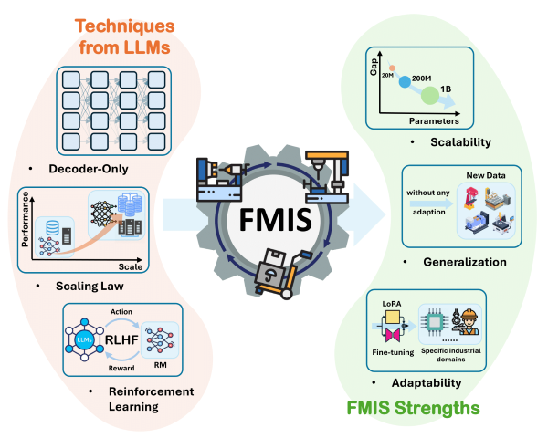
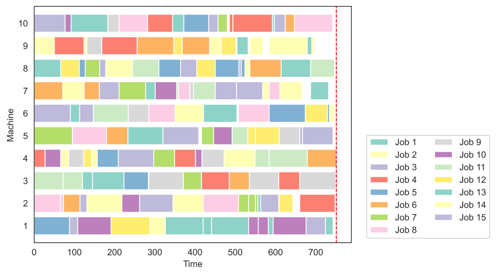

# Foundation Models for Industrial Scheduling



Inspired by the key technologies and design ideas in LLMs, we develop a foundation model for industrial scheduling using key technologies that are critical to the success of LLMs. Thanks to the techniques from LLMs, our foundation models exhibit scalability, generalization, and adaptability in industrial problems comparable to LLMs in NLP. 

Here is the original code of our work, including training and testing. 

## Requirements

- python 3.10 ⬆
- pytorch 2.4.0 ⬆
- accelerate 0.32.1
- numpy
- matplotlib
- seaborn
- tqdm

## QuickStart

### Test

```bash
python test.py --actor_path models/Distillate4Demo/actor.pth --critic_path models/Distillate4Demo/critic.pth --FJSPpath data/HurinkBenchmark/HurinkVdata25.fjs --num_beams 32--GANTTsavepath results/Gantt.png
```

Expected results: 

```bash
Makespan: 748
```



**Note**: Since job serial numbers are randomly assigned in the current implementation, the results are somewhat random. 

### Train

```bash
accelerate launch --multi_gpu --mixed_precision=bf16 --num_processes=8 Train.py --n 10 --m 10 --h 10 --n_epoch 80000 --batch_size_envs 32 --batch_size_ppo 256 --beta 0.01 --config_actor_deep 8 --config_actor_dim 1024 --config_actor_mlp_ratio 4 --config_critic_deep 8 --config_critic_dim 1024 --config_critic_mlp_ratio 4
```

If you want to train your foundation models for industrial scheduling, configure parameters such as num_processes and batch size according to your computational resources. Note that since the results of our work may be affected by changes in these parameters, please adjust the learning rate in conjunction. 

## Models

To make it easier to test and submit models, we distill the XXL model to make it a size that can be easily uploaded. We distilled XXL(2B) to obtain a model *Distillate4Demo* sized for uploading (≈60m) on $10\times 10$ instances.  *Distillate4Demo*'s performance is slightly worse than the original model, but still far better than the baseline algorithms. The parameters of *Distillate4Demo* are set as follows: 

```Python
config_actor = {
    "deep": 4,
    "dim": 512,
    "n_head": 16,
    "mlp_ratio": 2,
}
config_critic = {
    "deep": 4,
    "dim": 512,
    "n_head": 16,
    "mlp_ratio": 2,
}
```

## TODO

Because of the ongoing work on organizing the source code and the imperfections of the work, we still have the following work waiting to be done: 

- Solving loss spike problems 
- Enhanced Visualization 
- Enhanced scalability for the number of processes and machines 

